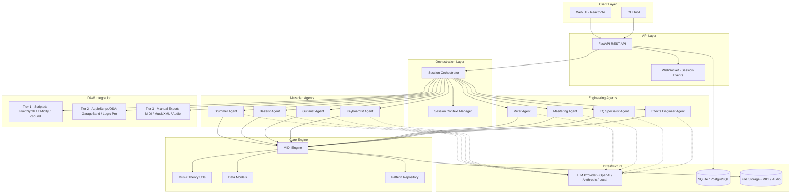
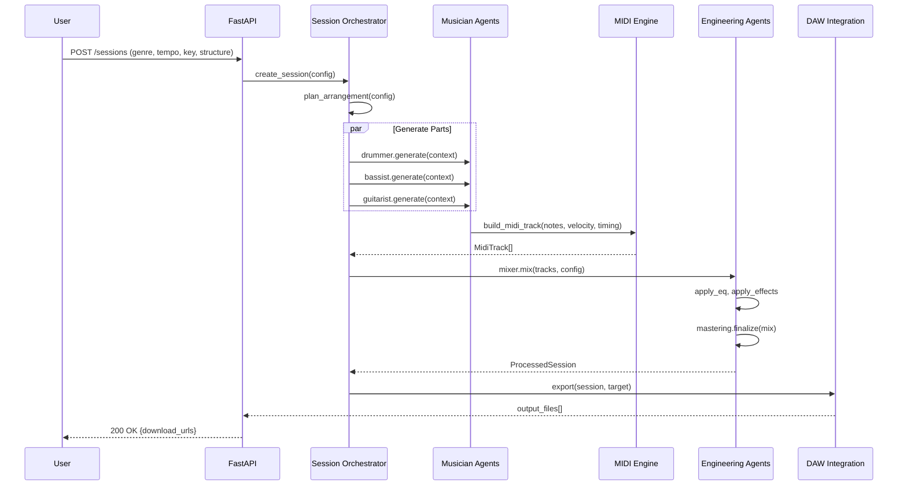
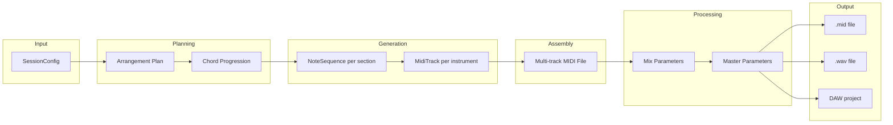
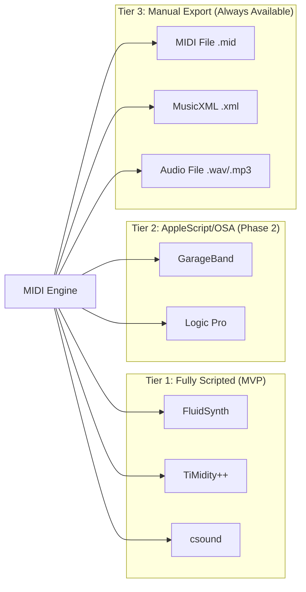
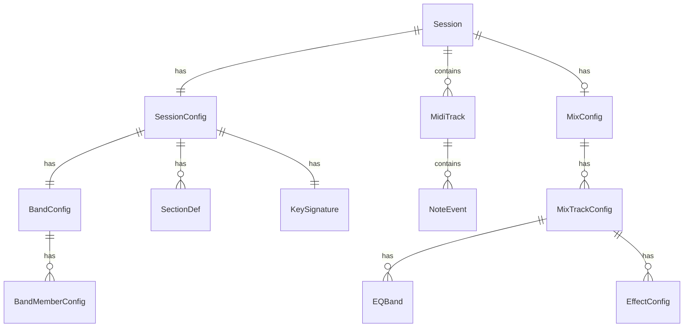

# AI Music Studio — Architecture Document

> **Version:** 0.1.0 (MVP)
> **Last Updated:** 2026-04-05
> **Status:** Draft

---

## 1. System Overview

AI Music Studio is a multi-agent system that generates MIDI backing tracks by simulating a session band. LLM-powered musician agents collaborate under a session orchestrator to produce genre-appropriate parts, which are then processed by audio engineering agents for mixing and mastering. Output is delivered as MIDI files, rendered audio, or routed directly into DAWs.

### 1.1 High-Level Architecture



### 1.2 Request Flow



---

## 2. Component Breakdown

### 2.1 Project Structure

```
audio_engineer/
├── pyproject.toml
├── README.md
├── docs/
│   ├── ARCHITECTURE.md
│   └── MVP_PLAN.md
├── src/
│   └── audio_engineer/
│       ├── __init__.py
│       ├── core/
│       │   ├── __init__.py
│       │   ├── midi_engine.py        # MidiEngine, MidiTrackBuilder
│       │   ├── music_theory.py       # Scale, Chord, Progression, Key
│       │   ├── models.py             # Pydantic data models
│       │   ├── patterns.py           # PatternRepository, DrumPattern, etc.
│       │   ├── rhythm.py             # TimeSignature, Groove, Swing
│       │   └── constants.py          # MIDI constants, GM drum map, etc.
│       ├── agents/
│       │   ├── __init__.py
│       │   ├── base.py               # BaseMusician, BaseEngineer
│       │   ├── musician/
│       │   │   ├── __init__.py
│       │   │   ├── drummer.py         # DrummerAgent
│       │   │   ├── bassist.py         # BassistAgent
│       │   │   ├── guitarist.py       # GuitaristAgent
│       │   │   └── keyboardist.py     # KeyboardistAgent
│       │   ├── engineer/
│       │   │   ├── __init__.py
│       │   │   ├── mixer.py           # MixerAgent
│       │   │   ├── mastering.py       # MasteringAgent
│       │   │   ├── eq_specialist.py   # EQSpecialistAgent
│       │   │   └── effects.py         # EffectsEngineerAgent
│       │   └── orchestrator.py        # SessionOrchestrator
│       ├── daw/
│       │   ├── __init__.py
│       │   ├── base.py               # DAWBackend ABC
│       │   ├── fluidsynth.py         # FluidSynthBackend
│       │   ├── timidity.py           # TiMidityBackend
│       │   ├── csound.py             # CsoundBackend
│       │   ├── garageband.py         # GarageBandBackend (AppleScript)
│       │   ├── logic_pro.py          # LogicProBackend (AppleScript)
│       │   └── export.py             # FileExportBackend (MIDI/MusicXML)
│       ├── api/
│       │   ├── __init__.py
│       │   ├── app.py                # FastAPI application factory
│       │   ├── routes/
│       │   │   ├── __init__.py
│       │   │   ├── sessions.py        # /sessions endpoints
│       │   │   ├── tracks.py          # /tracks endpoints
│       │   │   ├── agents.py          # /agents endpoints
│       │   │   └── exports.py         # /exports endpoints
│       │   ├── schemas.py             # API request/response schemas
│       │   ├── deps.py                # Dependency injection
│       │   └── websocket.py           # WebSocket session events
│       ├── ui/
│       │   └── static/               # Built frontend assets
│       └── config/
│           ├── __init__.py
│           ├── settings.py            # Pydantic Settings
│           └── logging.py             # Logging configuration
├── tests/
│   ├── conftest.py
│   ├── core/
│   ├── agents/
│   ├── daw/
│   └── api/
└── scripts/
    ├── run_dev.py
    └── generate_demo.py
```

---

## 3. Agent Hierarchy and Responsibilities

### 3.1 Agent Class Hierarchy

```mermaid
classDiagram
    class BaseAgent {
        <<abstract>>
        +name: str
        +role: AgentRole
        +llm: BaseChatModel
        +generate(context: SessionContext) MidiTrack
        #_build_prompt(context) str
        #_parse_response(response) NoteSequence
    }

    class BaseMusician {
        <<abstract>>
        +instrument: Instrument
        +midi_channel: int
        +style_profile: StyleProfile
        +generate_part(context) MidiTrack
        +improvise(context, constraints) MidiTrack
    }

    class BaseEngineer {
        <<abstract>>
        +process(tracks: list~MidiTrack~, context) ProcessedTracks
        #_analyze(tracks) AnalysisResult
    }

    class DrummerAgent {
        +instrument = DRUMS
        +midi_channel = 9
        +generate_pattern(style, time_sig) DrumPattern
        +generate_fill(context) DrumFill
    }

    class BassistAgent {
        +instrument = BASS
        +midi_channel = 1
        +generate_bassline(chord_prog, style) NoteSequence
        +walk_bass(changes) NoteSequence
    }

    class GuitaristAgent {
        +instrument = GUITAR
        +midi_channel = 2
        +generate_rhythm(chord_prog, style) NoteSequence
        +generate_riff(key, scale) NoteSequence
    }

    class KeyboardistAgent {
        +instrument = KEYS
        +midi_channel = 3
        +generate_comping(chord_prog, style) NoteSequence
        +generate_pad(chord_prog, voicing) NoteSequence
    }

    class MixerAgent {
        +assign_levels(tracks) MixConfig
        +assign_panning(tracks) PanConfig
    }

    class MasteringAgent {
        +finalize(mix) MasterConfig
    }

    class EQSpecialistAgent {
        +analyze_frequency_conflicts(tracks) EQConfig
    }

    class EffectsEngineerAgent {
        +suggest_effects(track, genre) EffectsChain
    }

    class SessionOrchestrator {
        +session: Session
        +musicians: list~BaseMusician~
        +engineers: list~BaseEngineer~
        +run_session(config) SessionResult
        +plan_arrangement(config) Arrangement
        -_coordinate_generation() list~MidiTrack~
        -_run_engineering_pipeline(tracks) ProcessedTracks
    }

    BaseAgent <|-- BaseMusician
    BaseAgent <|-- BaseEngineer
    BaseMusician <|-- DrummerAgent
    BaseMusician <|-- BassistAgent
    BaseMusician <|-- GuitaristAgent
    BaseMusician <|-- KeyboardistAgent
    BaseEngineer <|-- MixerAgent
    BaseEngineer <|-- MasteringAgent
    BaseEngineer <|-- EQSpecialistAgent
    BaseEngineer <|-- EffectsEngineerAgent
    SessionOrchestrator --> BaseMusician
    SessionOrchestrator --> BaseEngineer
```



### 3.2 Agent Responsibilities

| Agent                    | Input                                               | Output                                 | LLM Usage                                             |
| ------------------------ | --------------------------------------------------- | -------------------------------------- | ----------------------------------------------------- |
| **DrummerAgent**         | Genre, tempo, time signature, song structure        | Drum MIDI track (channel 10/GM)        | Pattern selection, fill placement, dynamics           |
| **BassistAgent**         | Chord progression, key, genre, drum track reference | Bass MIDI track                        | Note choice, rhythm syncopation, style matching       |
| **GuitaristAgent**       | Chord progression, key, genre, other parts          | Guitar MIDI track (rhythm/lead)        | Voicing selection, strumming pattern, riff generation |
| **KeyboardistAgent**     | Chord progression, key, genre, arrangement density  | Keys MIDI track                        | Voicing, comping style, texture decisions             |
| **MixerAgent**           | All generated MIDI tracks, genre                    | Volume levels, pan positions per track | Balance decisions, genre-appropriate mixing           |
| **EQSpecialistAgent**    | Track frequency analysis, genre                     | EQ curves per track                    | Frequency conflict resolution                         |
| **EffectsEngineerAgent** | Track characteristics, genre                        | Effects chain per track                | Reverb/delay/modulation choices                       |
| **MasteringAgent**       | Full mix                                            | Final processing parameters            | Loudness targets, stereo width, final EQ              |

### 3.3 Session Orchestrator Flow

The `SessionOrchestrator` manages the generation pipeline:

1. **Plan Phase** — LLM determines song structure (intro, verse, chorus, bridge, outro) with bar counts
2. **Foundation Phase** — Drummer generates pattern; bassist locks to drums
3. **Harmony Phase** — Guitarist and keyboardist generate parts aware of each other
4. **Engineering Phase** — Sequential: EQ → Effects → Mix → Master
5. **Export Phase** — Output to selected DAW backend

---

## 4. MIDI Generation Pipeline

### 4.1 Pipeline Stages



### 4.2 Core MIDI Engine (`src/audio_engineer/core/midi_engine.py`)

```python
class MidiEngine:
    """Central MIDI file construction and manipulation engine."""

    def create_track(self, instrument: Instrument, channel: int) -> MidiTrackBuilder
    def merge_tracks(self, tracks: list[MidiTrack]) -> MidiFile
    def quantize(self, track: MidiTrack, resolution: int) -> MidiTrack
    def humanize(self, track: MidiTrack, timing_variance: float, velocity_variance: float) -> MidiTrack
    def export_midi(self, midi_file: MidiFile, path: Path) -> Path
    def export_musicxml(self, midi_file: MidiFile, path: Path) -> Path


class MidiTrackBuilder:
    """Fluent builder for constructing MIDI tracks."""

    def set_tempo(self, bpm: int) -> Self
    def set_time_signature(self, numerator: int, denominator: int) -> Self
    def add_note(self, pitch: int, velocity: int, start_tick: int, duration_ticks: int) -> Self
    def add_chord(self, pitches: list[int], velocity: int, start_tick: int, duration_ticks: int) -> Self
    def add_cc(self, controller: int, value: int, tick: int) -> Self
    def build(self) -> MidiTrack
```

The engine wraps the `mido` library and adds:

- Tick-to-beat-to-bar coordinate system
- Humanization (timing drift, velocity variation)
- Quantization at configurable resolution
- Chord voicing expansion

### 4.3 Music Theory Utilities (`src/audio_engineer/core/music_theory.py`)

```python
class Key:
    root: Note         # e.g., Note.C
    mode: Mode         # e.g., Mode.MAJOR, Mode.MINOR, Mode.MIXOLYDIAN

class Scale:
    key: Key
    def degrees(self) -> list[int]              # MIDI intervals
    def note_at_degree(self, degree: int) -> int # MIDI note number

class Chord:
    root: Note
    quality: ChordQuality  # MAJOR, MINOR, DOM7, MAJ7, MIN7, DIM, AUG, SUS2, SUS4
    def midi_notes(self, octave: int, voicing: Voicing) -> list[int]

class ChordProgression:
    key: Key
    chords: list[tuple[Chord, float]]  # (chord, duration_in_beats)
    def transpose(self, semitones: int) -> ChordProgression
    def to_roman_numerals(self) -> list[str]

class ProgressionFactory:
    """Common progressions by genre."""
    @staticmethod
    def classic_rock_I_IV_V(key: Key) -> ChordProgression
    @staticmethod
    def twelve_bar_blues(key: Key) -> ChordProgression
    @staticmethod
    def pop_I_V_vi_IV(key: Key) -> ChordProgression
```

---

## 5. DAW Integration Strategy

### 5.1 Three-Tier Architecture



### 5.2 DAW Backend Interface

```python
# src/audio_engineer/daw/base.py
class DAWBackend(ABC):
    """Abstract base for all DAW integrations."""

    @abstractmethod
    def render_audio(self, midi_file: MidiFile, config: RenderConfig) -> Path:
        """Render MIDI to audio file."""

    @abstractmethod
    def is_available(self) -> bool:
        """Check if this backend is installed and usable."""

    @abstractmethod
    def supported_formats(self) -> list[AudioFormat]:
        """Return supported output audio formats."""

    def get_info(self) -> DAWInfo:
        """Return backend metadata."""
```

### 5.3 Tier Details

| Tier | Backend             | Method                              | Platform              | MVP?    |
| ---- | ------------------- | ----------------------------------- | --------------------- | ------- |
| 1    | `FluidSynthBackend` | Subprocess (`fluidsynth` CLI)       | macOS, Linux, Windows | **Yes** |
| 1    | `TiMidityBackend`   | Subprocess (`timidity` CLI)         | macOS, Linux          | **Yes** |
| 1    | `CsoundBackend`     | Subprocess + `.csd` orchestra files | All                   | Phase 2 |
| 2    | `GarageBandBackend` | AppleScript via `osascript`         | macOS only            | Phase 2 |
| 2    | `LogicProBackend`   | AppleScript via `osascript`         | macOS only            | Phase 3 |
| 3    | `FileExportBackend` | Direct file write                   | All                   | **Yes** |

**Tier 1 (Scripted)** — Fully automated. FluidSynth and TiMidity accept MIDI files and render to WAV with SoundFont instruments. No GUI interaction needed.

**Tier 2 (AppleScript/OSA)** — Semi-automated. Uses macOS AppleScript to launch GarageBand/Logic Pro, import MIDI, and trigger export. Fragile but functional.

**Tier 3 (Manual Export)** — Always available. Writes `.mid` and `.musicxml` files that users drag into any DAW manually.

### 5.4 SoundFont Management

For Tier 1 rendering, the system manages SoundFonts (`.sf2` files):

```python
class SoundFontManager:
    def list_available(self) -> list[SoundFontInfo]
    def get_default(self) -> Path          # Ships with GeneralUser GS or FluidR3
    def get_for_genre(self, genre: Genre) -> Path
    def download(self, url: str) -> Path   # Fetch from known-good sources
```

---

## 6. API Design

### 6.1 REST Endpoints

#### Sessions

| Method   | Path                             | Description               |
| -------- | -------------------------------- | ------------------------- |
| `POST`   | `/api/v1/sessions`               | Create a new session      |
| `GET`    | `/api/v1/sessions`               | List sessions (paginated) |
| `GET`    | `/api/v1/sessions/{id}`          | Get session details       |
| `DELETE` | `/api/v1/sessions/{id}`          | Delete a session          |
| `POST`   | `/api/v1/sessions/{id}/generate` | Trigger MIDI generation   |
| `GET`    | `/api/v1/sessions/{id}/status`   | Poll generation status    |

#### Tracks

| Method | Path                                                 | Description             |
| ------ | ---------------------------------------------------- | ----------------------- |
| `GET`  | `/api/v1/sessions/{id}/tracks`                       | List tracks in session  |
| `GET`  | `/api/v1/sessions/{id}/tracks/{track_id}`            | Get track details       |
| `PUT`  | `/api/v1/sessions/{id}/tracks/{track_id}`            | Update track parameters |
| `POST` | `/api/v1/sessions/{id}/tracks/{track_id}/regenerate` | Regenerate single track |

#### Exports

| Method | Path                                       | Description                     |
| ------ | ------------------------------------------ | ------------------------------- |
| `POST` | `/api/v1/sessions/{id}/export`             | Export session to target format |
| `GET`  | `/api/v1/sessions/{id}/export/{export_id}` | Download exported file          |
| `GET`  | `/api/v1/backends`                         | List available DAW backends     |

#### Agents

| Method | Path                           | Description                            |
| ------ | ------------------------------ | -------------------------------------- |
| `GET`  | `/api/v1/agents`               | List available agents and their status |
| `GET`  | `/api/v1/agents/{name}/styles` | Get supported styles for an agent      |

### 6.2 WebSocket

| Endpoint                            | Purpose                             |
| ----------------------------------- | ----------------------------------- |
| `ws://host/api/v1/sessions/{id}/ws` | Real-time session generation events |

Events pushed over WebSocket:

```json
{"event": "generation.started", "agent": "drummer", "section": "verse"}
{"event": "generation.completed", "agent": "drummer", "section": "verse", "duration_ms": 1200}
{"event": "engineering.started", "stage": "mixing"}
{"event": "session.completed", "download_url": "/api/v1/sessions/abc/export/def"}
{"event": "session.error", "message": "LLM timeout", "agent": "bassist"}
```

### 6.3 Request/Response Examples

**Create Session:**

```json
POST /api/v1/sessions
{
    "name": "Classic Rock Demo",
    "genre": "classic_rock",
    "tempo_bpm": 120,
    "key": {"root": "E", "mode": "minor"},
    "time_signature": {"numerator": 4, "denominator": 4},
    "duration_bars": 32,
    "structure": ["intro:4", "verse:8", "chorus:8", "verse:8", "chorus:8", "outro:4"],
    "band": {
        "drummer": {"style": "john_bonham", "intensity": 0.7},
        "bassist": {"style": "classic_rock", "intensity": 0.6},
        "guitarist": {"style": "power_chords", "intensity": 0.8}
    },
    "chord_progression": {
        "verse": "i - VI - III - VII",
        "chorus": "i - VI - IV - V"
    }
}
```

**Response:**

```json
{
    "id": "sess_abc123",
    "status": "created",
    "created_at": "2026-04-05T12:00:00Z",
    "config": { ... },
    "tracks": [],
    "links": {
        "generate": "/api/v1/sessions/sess_abc123/generate",
        "ws": "ws://host/api/v1/sessions/sess_abc123/ws"
    }
}
```

---

## 7. Data Models

### 7.1 Core Models (`src/audio_engineer/core/models.py`)

```python
from enum import Enum
from pydantic import BaseModel, Field
from datetime import datetime
from uuid import UUID, uuid4

# ─── Enums ───

class Genre(str, Enum):
    CLASSIC_ROCK = "classic_rock"
    BLUES = "blues"
    POP = "pop"
    JAZZ = "jazz"
    FUNK = "funk"
    COUNTRY = "country"

class Instrument(str, Enum):
    DRUMS = "drums"
    BASS = "bass"
    ELECTRIC_GUITAR = "electric_guitar"
    ACOUSTIC_GUITAR = "acoustic_guitar"
    PIANO = "piano"
    ORGAN = "organ"
    SYNTH = "synth"

class Note(str, Enum):
    C = "C"; CS = "C#"; D = "D"; DS = "D#"; E = "E"; F = "F"
    FS = "F#"; G = "G"; GS = "G#"; A = "A"; AS = "A#"; B = "B"

class Mode(str, Enum):
    MAJOR = "major"
    MINOR = "minor"
    DORIAN = "dorian"
    MIXOLYDIAN = "mixolydian"
    PENTATONIC_MAJOR = "pentatonic_major"
    PENTATONIC_MINOR = "pentatonic_minor"
    BLUES = "blues"

class SessionStatus(str, Enum):
    CREATED = "created"
    GENERATING = "generating"
    MIXING = "mixing"
    MASTERING = "mastering"
    COMPLETED = "completed"
    FAILED = "failed"

# ─── Core Value Objects ───

class KeySignature(BaseModel):
    root: Note
    mode: Mode

class TimeSignature(BaseModel):
    numerator: int = 4
    denominator: int = 4

class SectionDef(BaseModel):
    name: str          # "verse", "chorus", "intro", etc.
    bars: int
    chord_progression: str | None = None  # Roman numeral notation

class NoteEvent(BaseModel):
    pitch: int              # MIDI note number 0-127
    velocity: int           # 0-127
    start_tick: int
    duration_ticks: int
    channel: int = 0

class MidiTrack(BaseModel):
    id: UUID = Field(default_factory=uuid4)
    instrument: Instrument
    channel: int
    events: list[NoteEvent]
    tempo_bpm: int
    time_signature: TimeSignature

# ─── Session Models ───

class BandMemberConfig(BaseModel):
    instrument: Instrument
    style: str = "default"
    intensity: float = Field(0.5, ge=0.0, le=1.0)
    enabled: bool = True

class BandConfig(BaseModel):
    drummer: BandMemberConfig | None = None
    bassist: BandMemberConfig | None = None
    guitarist: BandMemberConfig | None = None
    keyboardist: BandMemberConfig | None = None

class SessionConfig(BaseModel):
    name: str
    genre: Genre
    tempo_bpm: int = Field(120, ge=40, le=300)
    key: KeySignature
    time_signature: TimeSignature = TimeSignature()
    structure: list[SectionDef]
    band: BandConfig
    duration_bars: int | None = None

class Session(BaseModel):
    id: UUID = Field(default_factory=uuid4)
    config: SessionConfig
    status: SessionStatus = SessionStatus.CREATED
    tracks: list[MidiTrack] = []
    created_at: datetime = Field(default_factory=datetime.utcnow)
    completed_at: datetime | None = None
    error: str | None = None

# ─── Engineering Models ───

class EQBand(BaseModel):
    frequency_hz: float
    gain_db: float
    q: float = 1.0

class EffectConfig(BaseModel):
    effect_type: str       # "reverb", "delay", "chorus", "compression"
    parameters: dict

class MixTrackConfig(BaseModel):
    track_id: UUID
    volume_db: float = 0.0
    pan: float = Field(0.0, ge=-1.0, le=1.0)  # -1 left, +1 right
    eq_bands: list[EQBand] = []
    effects: list[EffectConfig] = []
    muted: bool = False
    solo: bool = False

class MixConfig(BaseModel):
    tracks: list[MixTrackConfig]
    master_volume_db: float = 0.0

class RenderConfig(BaseModel):
    format: str = "wav"           # wav, mp3, flac
    sample_rate: int = 44100
    bit_depth: int = 16
    soundfont: str | None = None  # path to .sf2
```

### 7.2 Entity Relationship



---

## 8. Technology Choices

| Component           | Technology                                      | Justification                                                                                               |
| ------------------- | ----------------------------------------------- | ----------------------------------------------------------------------------------------------------------- |
| **Language**        | Python 3.12+                                    | Rich music/audio ecosystem (mido, music21, pydub). LangChain native.                                        |
| **LLM Framework**   | LangChain + LangGraph                           | Agent orchestration, tool calling, structured output parsing. LangGraph for stateful multi-agent workflows. |
| **LLM Providers**   | OpenAI GPT-4o, Anthropic Claude, local (Ollama) | GPT-4o for structured MIDI token output. Ollama for offline/free dev.                                       |
| **MIDI Library**    | `mido` + `python-rtmidi`                        | Lightweight, well-maintained. Direct MIDI file R/W.                                                         |
| **Music Theory**    | Custom + `mingus` (optional)                    | Custom for control; mingus as reference for chord/scale math.                                               |
| **API Framework**   | FastAPI                                         | Async, auto-docs, Pydantic integration, WebSocket support.                                                  |
| **Task Queue**      | `asyncio` (MVP), Celery (scale)                 | MVP uses async tasks. Celery adds worker distribution later.                                                |
| **Database**        | SQLite (MVP), PostgreSQL (prod)                 | SQLite for zero-config dev. Postgres for multi-user prod.                                                   |
| **Audio Rendering** | FluidSynth, TiMidity++                          | Free, scriptable, cross-platform MIDI-to-audio.                                                             |
| **Frontend**        | React + Vite (future)                           | Component model fits session/track UI. Not in MVP.                                                          |
| **Config**          | Pydantic Settings + `.env`                      | Type-safe config with environment variable support.                                                         |
| **Testing**         | pytest + hypothesis                             | Property-based testing ideal for music theory invariants.                                                   |
| **Packaging**       | `pyproject.toml` + `hatch`                      | Modern Python packaging.                                                                                    |

---

## 9. MVP Scope vs. Future Phases

### 9.1 MVP (v0.1) — "Play a Rock Song"

**Goal:** Generate a multi-track MIDI file of a classic rock backing track (drums + bass + guitar) and render to audio.

**In scope:**

- Core MIDI engine with track building, quantization, humanization
- Music theory: scales, chords, progressions (major/minor/pentatonic/blues)
- Drum pattern library: basic rock beats, fills
- 3 musician agents: Drummer, Bassist, Guitarist (LangChain + structured output)
- Session orchestrator: sequential generation (drums → bass → guitar)
- Tier 1 DAW: FluidSynth rendering with bundled SoundFont
- Tier 3 DAW: MIDI file export
- FastAPI: session CRUD + generate + export endpoints
- CLI script for demo
- SQLite session persistence

**Out of scope for MVP:**

- Keyboardist agent
- All engineering agents (mix/master/EQ/effects)
- Web UI
- Tier 2 DAW integration (AppleScript)
- WebSocket events
- User accounts / multi-tenancy
- Real-time MIDI playback
- csound backend

### 9.2 Phase 2 — "Full Band + Engineering"

- Keyboardist agent
- Engineering agents (mixer, EQ, effects, mastering)
- Mix parameter output as metadata (no audio processing yet)
- csound backend
- WebSocket session events
- Expanded genre support (blues, jazz, funk)

### 9.3 Phase 3 — "Studio Experience"

- Web UI (React + Vite)
- GarageBand AppleScript integration
- Audio effects processing (pydub / pedalboard)
- Real-time MIDI preview in browser (Web MIDI API)
- Session history and versioning
- Style presets / "famous drummer" profiles

### 9.4 Phase 4 — "Production Ready"

- Logic Pro integration
- Multi-user with auth (OAuth2)
- PostgreSQL backend
- Celery task queue for generation
- Audio stem export
- MusicXML export for notation
- Plugin system for custom agents

---

## 10. Security Considerations

- **LLM Output Validation:** All LLM outputs are parsed through Pydantic models before becoming MIDI data. No raw LLM text is executed or written to disk.
- **File Paths:** All file operations use `pathlib.Path` with validation against a configured output directory. No path traversal.
- **API Auth:** MVP has no auth (local use). Phase 4 adds OAuth2 with scoped tokens.
- **Subprocess Execution:** DAW backends use `subprocess.run()` with explicit argument lists (no shell=True). Commands are allow-listed.
- **Input Validation:** All API inputs validated via Pydantic with constrained ranges (tempo 40-300, velocity 0-127, etc.).

---

## 11. Deployment

### 11.1 MVP (Local Development)

```bash
# Install
pip install -e ".[dev]"

# Run API server
uvicorn audio_engineer.api.app:create_app --factory --reload

# Generate demo track
python scripts/generate_demo.py --genre classic_rock --key E --mode minor --tempo 120
```

### 11.2 Production (Future)

```
Docker Compose:
  - api (FastAPI + Uvicorn)
  - worker (Celery)
  - redis (broker)
  - postgres (persistence)
  - fluidsynth (rendering sidecar)
```

---

_This is a living document. Updated as architecture decisions are made and refined._
