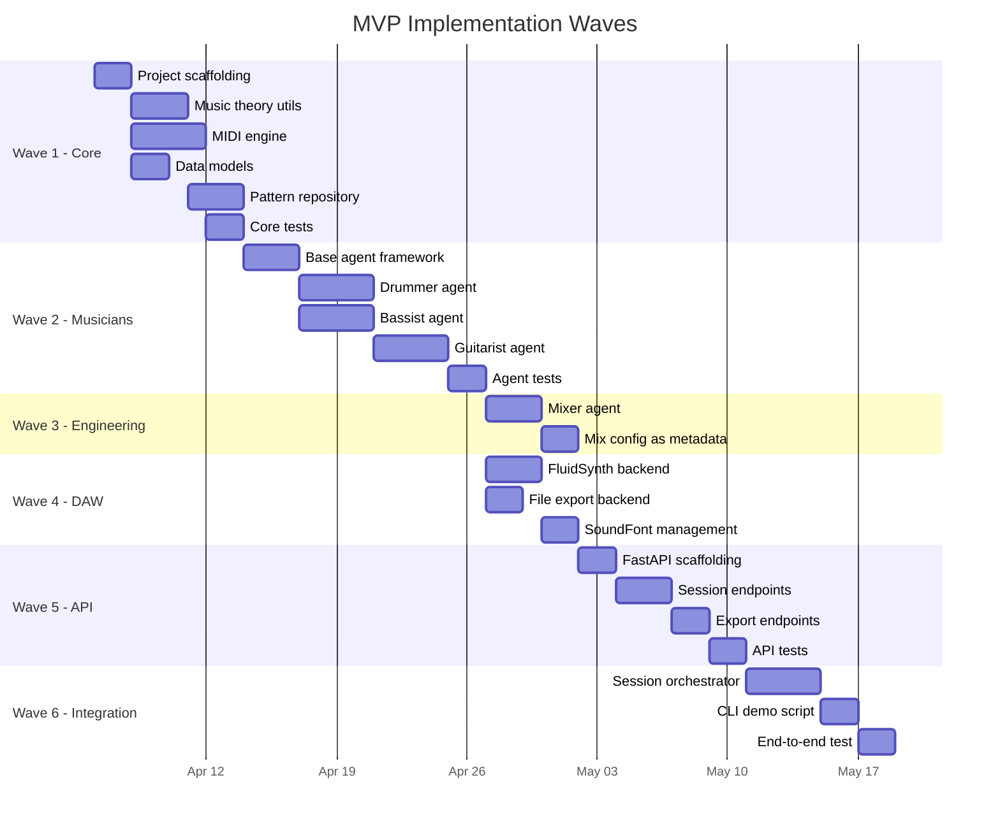

# AI Music Studio — MVP Implementation Plan

> **Version:** 0.1.0
> **Last Updated:** 2026-04-05
> **Target:** Classic rock trio/quartet backing track generation via MIDI

---

## Overview

The MVP is delivered in 6 waves, each building on the previous. Each wave produces testable, demonstrable output. The final demo: a user provides genre, key, tempo, and structure — the system generates a multi-track MIDI file and renders it to WAV audio.



---

## Wave 1: Core MIDI Engine, Music Theory, Data Models

**Goal:** Build the foundation that all agents and integrations depend on. No LLM usage yet — pure algorithmic music generation primitives.

### 1.1 Project Scaffolding

**Files to create:**

| File                                  | Purpose                                      |
| ------------------------------------- | -------------------------------------------- |
| `pyproject.toml`                      | Project metadata, dependencies, build config |
| `src/audio_engineer/__init__.py`      | Package root with `__version__`              |
| `src/audio_engineer/core/__init__.py` | Core package                                 |
| `tests/conftest.py`                   | Shared fixtures                              |

**`pyproject.toml` key dependencies:**

```toml
[project]
name = "audio-engineer"
version = "0.1.0"
requires-python = ">=3.12"
dependencies = [
    "mido>=1.3.0",
    "python-rtmidi>=1.5.0",
    "pydantic>=2.5",
    "pydantic-settings>=2.1",
]

[project.optional-dependencies]
llm = [
    "langchain>=0.3",
    "langchain-openai>=0.2",
    "langgraph>=0.2",
]
api = [
    "fastapi>=0.110",
    "uvicorn[standard]>=0.27",
]
audio = [
    "pydub>=0.25",
]
dev = [
    "pytest>=8.0",
    "pytest-asyncio>=0.23",
    "hypothesis>=6.90",
    "ruff>=0.3",
    "mypy>=1.8",
]
```

### 1.2 Data Models

**File:** `src/audio_engineer/core/models.py`

Implement all Pydantic models from ARCHITECTURE.md §7.1:

- Enums: `Genre`, `Instrument`, `Note`, `Mode`, `SessionStatus`, `ChordQuality`
- Value objects: `KeySignature`, `TimeSignature`, `SectionDef`, `NoteEvent`
- Domain: `MidiTrack`, `BandMemberConfig`, `BandConfig`, `SessionConfig`, `Session`
- Engineering: `EQBand`, `EffectConfig`, `MixTrackConfig`, `MixConfig`, `RenderConfig`

**Tests:** `tests/core/test_models.py`

- Validation: tempo range (40-300), velocity (0-127), pan (-1 to 1)
- Serialization round-trip for all models
- Default value behavior

### 1.3 Music Theory Utilities

**File:** `src/audio_engineer/core/music_theory.py`

| Class                | Key Methods                                                          |
| -------------------- | -------------------------------------------------------------------- |
| `Scale`              | `degrees()`, `note_at_degree(degree, octave)`, `contains(midi_note)` |
| `Chord`              | `midi_notes(octave, voicing)`, `from_roman(numeral, key)`            |
| `ChordProgression`   | `from_string("I - IV - V")`, `transpose(semitones)`, `resolve(key)`  |
| `ProgressionFactory` | `classic_rock_I_IV_V()`, `twelve_bar_blues()`, `pop_I_V_vi_IV()`     |

**File:** `src/audio_engineer/core/constants.py`

```python
# MIDI note numbers
MIDDLE_C = 60
MIDI_DRUM_CHANNEL = 9

# General MIDI drum map (subset for MVP)
GM_DRUMS = {
    "kick": 36,
    "snare": 38,
    "closed_hihat": 42,
    "open_hihat": 46,
    "crash": 49,
    "ride": 51,
    "floor_tom": 43,
    "mid_tom": 47,
    "high_tom": 50,
}

# Intervals in semitones
INTERVALS = {
    "P1": 0, "m2": 1, "M2": 2, "m3": 3, "M3": 4,
    "P4": 5, "TT": 6, "P5": 7, "m6": 8, "M6": 9,
    "m7": 10, "M7": 11, "P8": 12,
}

# Scale formulas (semitone intervals from root)
SCALE_FORMULAS = {
    "major":            [0, 2, 4, 5, 7, 9, 11],
    "minor":            [0, 2, 3, 5, 7, 8, 10],
    "dorian":           [0, 2, 3, 5, 7, 9, 10],
    "mixolydian":       [0, 2, 4, 5, 7, 9, 10],
    "pentatonic_major": [0, 2, 4, 7, 9],
    "pentatonic_minor": [0, 3, 5, 7, 10],
    "blues":            [0, 3, 5, 6, 7, 10],
}
```

**Tests:** `tests/core/test_music_theory.py`

- `Scale("C", "major").degrees()` → `[0, 2, 4, 5, 7, 9, 11]`
- `Chord.from_roman("V", Key("C", "major"))` → G major → MIDI notes [55, 59, 62] at octave 3
- `ChordProgression.from_string("I - IV - V", Key("A", "major"))` → [A, D, E]
- Transposition: `prog.transpose(2)` shifts all chords up 2 semitones
- Property tests: scale notes always within 0-127, chord inversions preserve pitch classes

### 1.4 MIDI Engine

**File:** `src/audio_engineer/core/midi_engine.py`

| Class              | Responsibilities                             |
| ------------------ | -------------------------------------------- |
| `MidiEngine`       | File-level operations: create, merge, export |
| `MidiTrackBuilder` | Fluent API for building individual tracks    |
| `TickConverter`    | Convert between ticks, beats, bars           |

Key implementation details:

```python
class TickConverter:
    """Convert between absolute ticks, beats, and bars."""

    def __init__(self, ticks_per_beat: int = 480, time_sig: TimeSignature = TimeSignature()):
        self.ticks_per_beat = ticks_per_beat
        self.ticks_per_bar = ticks_per_beat * time_sig.numerator

    def bars_to_ticks(self, bars: float) -> int: ...
    def beats_to_ticks(self, beats: float) -> int: ...
    def beat_position(self, bar: int, beat: int) -> int: ...
```

Humanization algorithm:

```python
def humanize(self, track: MidiTrack, timing_ms: float = 10.0, velocity_range: int = 8) -> MidiTrack:
    """Add human-like imprecision to a quantized track.

    Args:
        timing_ms: Max timing deviation in milliseconds (converted to ticks).
        velocity_range: Max +/- velocity deviation.
    """
```

**Tests:** `tests/core/test_midi_engine.py`

- Build a 4-bar drum pattern → export to `.mid` → read back → verify events
- Merge 3 tracks → single MIDI file with 3 tracks
- Quantize: off-grid notes snap to nearest subdivision
- Humanize: output varies from input but stays within bounds

### 1.5 Pattern Repository

**File:** `src/audio_engineer/core/patterns.py`

```python
class DrumPattern(BaseModel):
    """A single bar drum pattern."""
    name: str
    genre: Genre
    time_signature: TimeSignature
    kicks: list[float]       # Beat positions (1.0, 2.5, 3.0, ...)
    snares: list[float]
    hihats: list[float]
    velocity_map: dict[str, int] = {"kick": 100, "snare": 95, "hihat": 80}

class PatternRepository:
    """Library of drum and bass patterns indexed by genre."""

    def get_drum_patterns(self, genre: Genre) -> list[DrumPattern]
    def get_bass_patterns(self, genre: Genre) -> list[BassPattern]
    def register_pattern(self, pattern: DrumPattern | BassPattern) -> None
```

Built-in patterns for MVP:

| Pattern             | Genre        | Description                                |
| ------------------- | ------------ | ------------------------------------------ |
| `rock_straight_8th` | classic_rock | Kick on 1/3, snare on 2/4, 8th-note hihats |
| `rock_driving`      | classic_rock | Kick on 1/2/3/4, snare on 2/4, 8th hihats  |
| `rock_half_time`    | classic_rock | Kick on 1, snare on 3, quarter hihats      |
| `rock_fill_1`       | classic_rock | Tom roll across beats 3-4                  |
| `blues_shuffle`     | blues        | Swing-feel kick/snare with shuffle hihats  |

**Tests:** `tests/core/test_patterns.py`

- All registered patterns produce valid NoteEvents within MIDI range
- Genre lookup returns non-empty list for supported genres

### 1.6 Wave 1 Acceptance Criteria

- [ ] `python -c "from audio_engineer.core.models import Session"` works
- [ ] `MidiEngine().export_midi(...)` produces a valid `.mid` file playable in any MIDI player
- [ ] `Scale("C", "major").note_at_degree(5, octave=4)` → 67 (G4)
- [ ] `ChordProgression.from_string("I - IV - V", Key("E", "minor"))` resolves correctly
- [ ] `PatternRepository().get_drum_patterns(Genre.CLASSIC_ROCK)` returns ≥3 patterns
- [ ] All tests pass, ruff+mypy clean

---

## Wave 2: Musician Agents with LangChain

**Goal:** LLM-powered agents that translate musical intent into MIDI data. Each agent receives session context and produces a `MidiTrack`.

### 2.1 Base Agent Framework

**File:** `src/audio_engineer/agents/base.py`

```python
class BaseMusician(ABC):
    """Base class for all musician agents."""

    def __init__(self, llm: BaseChatModel, instrument: Instrument, channel: int):
        self.llm = llm
        self.instrument = instrument
        self.channel = channel
        self.midi_engine = MidiEngine()

    @abstractmethod
    def generate_part(self, context: SessionContext) -> MidiTrack:
        """Generate a MIDI track for the full song structure."""

    def _create_chain(self, prompt_template: str) -> RunnableSequence:
        """Build a LangChain chain with structured output parsing."""

    def _parse_to_events(self, llm_output: StructuredOutput) -> list[NoteEvent]:
        """Convert LLM structured output to MIDI events."""
```

**`SessionContext`** — the shared context passed to all agents:

```python
class SessionContext(BaseModel):
    config: SessionConfig
    arrangement: list[SectionDef]
    chord_progression: dict[str, ChordProgression]  # section_name → progression
    existing_tracks: dict[Instrument, MidiTrack]     # tracks generated so far
    current_section: str | None = None
```

### 2.2 LLM Output Schema

Agents use LangChain structured output to get reliable MIDI data:

```python
class LLMNoteOutput(BaseModel):
    """Schema for LLM-generated note sequences."""
    notes: list[LLMNote]

class LLMNote(BaseModel):
    pitch: int = Field(ge=0, le=127, description="MIDI note number")
    velocity: int = Field(ge=1, le=127, description="Note velocity")
    bar: int = Field(ge=1, description="Bar number (1-indexed)")
    beat: float = Field(ge=1.0, description="Beat position within bar (1.0 = downbeat)")
    duration_beats: float = Field(gt=0, description="Note duration in beats")
```

### 2.3 Drummer Agent

**File:** `src/audio_engineer/agents/musician/drummer.py`

```python
class DrummerAgent(BaseMusician):
    def __init__(self, llm: BaseChatModel):
        super().__init__(llm, Instrument.DRUMS, channel=9)
        self.pattern_repo = PatternRepository()

    def generate_part(self, context: SessionContext) -> MidiTrack:
        """Generate drum track for entire song.

        Strategy:
        1. Select base pattern from PatternRepository based on genre
        2. Use LLM to decide: where to place fills, dynamics per section,
           hihat open/close variation, crash placement
        3. Assemble pattern instances + fills into full track
        4. Apply humanization
        """

    def _select_pattern(self, genre: Genre, section: str) -> DrumPattern: ...
    def _generate_fill_placement(self, context: SessionContext) -> list[int]: ...
    def _apply_dynamics(self, track: MidiTrack, section: str) -> MidiTrack: ...
```

**Prompt strategy:** The LLM receives the song structure and outputs a JSON plan (which sections get fills, intensity curves, pattern variations). The actual MIDI generation is algorithmic based on that plan. This hybrid approach avoids asking the LLM to generate hundreds of individual note events.

### 2.4 Bassist Agent

**File:** `src/audio_engineer/agents/musician/bassist.py`

```python
class BassistAgent(BaseMusician):
    def __init__(self, llm: BaseChatModel):
        super().__init__(llm, Instrument.BASS, channel=1)

    def generate_part(self, context: SessionContext) -> MidiTrack:
        """Generate bass track.

        Strategy:
        1. Receive chord progression per section
        2. Use LLM to decide: rhythm pattern (root notes, walking, riff-based),
           approach notes, octave placement, syncopation level
        3. Generate note sequence from chords + LLM rhythm decisions
        4. Lock to drum kick pattern for groove alignment
        """

    def _root_note_pattern(self, chord_prog: ChordProgression, rhythm: str) -> list[NoteEvent]: ...
    def _walking_bass(self, chord_prog: ChordProgression, scale: Scale) -> list[NoteEvent]: ...
    def _lock_to_kick(self, bass_events: list[NoteEvent], drum_track: MidiTrack) -> list[NoteEvent]: ...
```

### 2.5 Guitarist Agent

**File:** `src/audio_engineer/agents/musician/guitarist.py`

```python
class GuitaristAgent(BaseMusician):
    def __init__(self, llm: BaseChatModel):
        super().__init__(llm, Instrument.ELECTRIC_GUITAR, channel=2)

    def generate_part(self, context: SessionContext) -> MidiTrack:
        """Generate guitar track.

        Strategy:
        1. Receive chord progression and existing bass/drum tracks
        2. LLM decides: voicing type (power chords, open, barre),
           strumming pattern, palm mute sections, accent placement
        3. Generate chord voicings using music theory
        4. Apply strumming pattern as velocity/timing variations
        """

    def _power_chord_voicing(self, root: int) -> list[int]: ...
    def _strum_pattern(self, chord_notes: list[int], pattern: str, beat: float) -> list[NoteEvent]: ...
```

### 2.6 Wave 2 Acceptance Criteria

- [ ] `DrummerAgent(llm).generate_part(context)` → valid MidiTrack with events on channel 9
- [ ] `BassistAgent(llm).generate_part(context)` → bass notes follow chord roots
- [ ] `GuitaristAgent(llm).generate_part(context)` → chord voicings match progression
- [ ] Agents work with mock LLM for testing (no API calls in CI)
- [ ] Generated parts export to a playable `.mid` file
- [ ] Bass locks to drum kick positions within timing tolerance

---

## Wave 3: Audio Engineering Agents

**Goal:** A lightweight Mixer agent that outputs mix configuration metadata. No audio processing yet — parameters are embedded as MIDI CC or exported as JSON.

### 3.1 Mixer Agent

**File:** `src/audio_engineer/agents/engineer/mixer.py`

```python
class MixerAgent(BaseEngineer):
    def __init__(self, llm: BaseChatModel):
        self.llm = llm

    def process(self, tracks: list[MidiTrack], context: SessionContext) -> MixConfig:
        """Generate mix configuration.

        Uses LLM to decide:
        - Volume levels per instrument (genre-appropriate)
        - Pan positions (drum kit spread, bass center, guitar L/R)
        - Basic EQ suggestions (high-pass bass, low-cut guitar)
        """
```

**Output:** `MixConfig` model with per-track volume, pan, and EQ band suggestions. In the MVP, this metadata is:

1. Embedded as MIDI CC messages (CC7=volume, CC10=pan) in the MIDI file
2. Exported as a sidecar `mix.json` file for DAW import

### 3.2 Wave 3 Acceptance Criteria

- [ ] `MixerAgent(llm).process(tracks, context)` → valid `MixConfig`
- [ ] Mix config contains sensible defaults (bass center-panned, guitar offset, drums spread)
- [ ] MIDI CC messages for volume/pan written into exported MIDI
- [ ] `mix.json` sidecar exported alongside MIDI file

---

## Wave 4: DAW Integration Layer

**Goal:** Render MIDI to audio via FluidSynth. Provide raw MIDI export as fallback.

### 4.1 File Export Backend

**File:** `src/audio_engineer/daw/export.py`

```python
class FileExportBackend(DAWBackend):
    """Tier 3: Direct file export."""

    def render_audio(self, midi_file: MidiFile, config: RenderConfig) -> Path:
        raise NotImplementedError("Use FluidSynth backend for audio rendering")

    def export_midi(self, midi_file: MidiFile, output_dir: Path) -> Path:
        """Write .mid file to output directory."""

    def is_available(self) -> bool:
        return True  # Always available
```

### 4.2 FluidSynth Backend

**File:** `src/audio_engineer/daw/fluidsynth.py`

```python
class FluidSynthBackend(DAWBackend):
    """Tier 1: FluidSynth CLI rendering."""

    def __init__(self, soundfont_path: Path | None = None):
        self.soundfont_path = soundfont_path or self._find_default_soundfont()

    def render_audio(self, midi_file: MidiFile, config: RenderConfig) -> Path:
        """Render MIDI to audio using FluidSynth.

        Runs: fluidsynth -ni <soundfont> <midi> -F <output.wav> -r <sample_rate>
        """

    def is_available(self) -> bool:
        """Check if fluidsynth is on PATH."""
        return shutil.which("fluidsynth") is not None

    def _find_default_soundfont(self) -> Path: ...
```

**SoundFont acquisition:** The MVP ships instructions for installing a free General MIDI SoundFont (FluidR3_GM or GeneralUser GS). A `scripts/setup_soundfont.py` script downloads one to `~/.audio_engineer/soundfonts/`.

### 4.3 SoundFont Manager

**File:** `src/audio_engineer/daw/soundfont.py`

```python
class SoundFontManager:
    SOUNDFONT_DIR = Path.home() / ".audio_engineer" / "soundfonts"
    DEFAULT_SOUNDFONT_URL = "https://member.keymusician.com/Member/FluidR3_GM/FluidR3_GM.sf2"

    def get_default(self) -> Path: ...
    def list_available(self) -> list[SoundFontInfo]: ...
    def ensure_default(self) -> Path:
        """Download default SoundFont if not present."""
```

### 4.4 Wave 4 Acceptance Criteria

- [ ] `FileExportBackend().export_midi(midi_file, dir)` → valid `.mid` on disk
- [ ] `FluidSynthBackend().render_audio(midi_file, config)` → valid `.wav` (if FluidSynth installed)
- [ ] `FluidSynthBackend().is_available()` correctly detects FluidSynth installation
- [ ] Graceful fallback when FluidSynth is not installed (error message, not crash)
- [ ] Generated WAV contains audible music matching MIDI content

---

## Wave 5: Web API

**Goal:** FastAPI REST API for session management, generation trigger, and file download.

### 5.1 Application Factory

**File:** `src/audio_engineer/api/app.py`

```python
def create_app() -> FastAPI:
    app = FastAPI(
        title="AI Music Studio",
        version="0.1.0",
        docs_url="/api/docs",
    )
    app.include_router(sessions_router, prefix="/api/v1")
    app.include_router(tracks_router, prefix="/api/v1")
    app.include_router(exports_router, prefix="/api/v1")
    return app
```

### 5.2 Session Endpoints

**File:** `src/audio_engineer/api/routes/sessions.py`

| Endpoint                              | Handler              | Description                                   |
| ------------------------------------- | -------------------- | --------------------------------------------- |
| `POST /api/v1/sessions`               | `create_session()`   | Validates `SessionConfig`, persists to SQLite |
| `GET /api/v1/sessions`                | `list_sessions()`    | Paginated list, filterable by status          |
| `GET /api/v1/sessions/{id}`           | `get_session()`      | Full session details including tracks         |
| `DELETE /api/v1/sessions/{id}`        | `delete_session()`   | Soft delete                                   |
| `POST /api/v1/sessions/{id}/generate` | `generate_session()` | Triggers async generation                     |
| `GET /api/v1/sessions/{id}/status`    | `get_status()`       | Poll generation progress                      |

### 5.3 Export Endpoints

**File:** `src/audio_engineer/api/routes/exports.py`

| Endpoint                                 | Handler             | Description                              |
| ---------------------------------------- | ------------------- | ---------------------------------------- |
| `POST /api/v1/sessions/{id}/export`      | `export_session()`  | Export to MIDI/WAV with selected backend |
| `GET /api/v1/sessions/{id}/export/{eid}` | `download_export()` | Download file (FileResponse)             |
| `GET /api/v1/backends`                   | `list_backends()`   | Available DAW backends                   |

### 5.4 Persistence

**File:** `src/audio_engineer/api/deps.py`

MVP uses SQLite via `aiosqlite` with a thin repository pattern:

```python
class SessionRepository:
    def __init__(self, db_path: Path):
        self.db_path = db_path

    async def create(self, session: Session) -> Session: ...
    async def get(self, session_id: UUID) -> Session | None: ...
    async def list(self, offset: int, limit: int) -> list[Session]: ...
    async def update_status(self, session_id: UUID, status: SessionStatus) -> None: ...
    async def delete(self, session_id: UUID) -> None: ...
```

Sessions are stored as JSON blobs in SQLite. No ORM — keeps it simple for MVP.

### 5.5 Wave 5 Acceptance Criteria

- [ ] `POST /api/v1/sessions` with valid config → 201 with session ID
- [ ] `POST /api/v1/sessions` with invalid config → 422 with field-level errors
- [ ] `GET /api/v1/sessions` → paginated list
- [ ] `POST /api/v1/sessions/{id}/generate` → 202 Accepted, generation starts
- [ ] `GET /api/v1/sessions/{id}/status` → current status during/after generation
- [ ] `POST /api/v1/sessions/{id}/export` → export file available for download
- [ ] OpenAPI docs at `/api/docs` accurately reflect all endpoints

---

## Wave 6: Session Orchestrator and End-to-End Demo

**Goal:** Wire everything together. The orchestrator coordinates agents and DAW backends. A CLI demo shows the full pipeline.

### 6.1 Session Orchestrator

**File:** `src/audio_engineer/agents/orchestrator.py`

```python
class SessionOrchestrator:
    def __init__(
        self,
        llm: BaseChatModel,
        musicians: list[BaseMusician] | None = None,
        engineers: list[BaseEngineer] | None = None,
        daw_backend: DAWBackend | None = None,
    ):
        self.llm = llm
        self.musicians = musicians or self._default_musicians()
        self.engineers = engineers or self._default_engineers()
        self.daw_backend = daw_backend or self._best_available_backend()

    async def run_session(self, config: SessionConfig) -> SessionResult:
        """Full pipeline: plan → generate → engineer → export.

        Steps:
        1. Plan arrangement (LLM decides exact structure, dynamics curve)
        2. Resolve chord progressions per section
        3. Generate drum track (foundation)
        4. Generate bass track (aware of drums)
        5. Generate guitar track (aware of drums + bass)
        6. Run mixer (generates mix config)
        7. Apply mix as MIDI CC
        8. Export to MIDI and render audio
        """

    def _default_musicians(self) -> list[BaseMusician]:
        return [
            DrummerAgent(self.llm),
            BassistAgent(self.llm),
            GuitaristAgent(self.llm),
        ]

    def _default_engineers(self) -> list[BaseEngineer]:
        return [MixerAgent(self.llm)]

    def _best_available_backend(self) -> DAWBackend:
        if FluidSynthBackend().is_available():
            return FluidSynthBackend()
        return FileExportBackend()
```

**`SessionResult`:**

```python
class SessionResult(BaseModel):
    session: Session
    midi_path: Path
    audio_path: Path | None     # None if no audio backend available
    mix_config_path: Path | None
    generation_log: list[str]   # Step-by-step log
    duration_seconds: float
```

### 6.2 CLI Demo Script

**File:** `scripts/generate_demo.py`

```python
"""Generate a demo backing track from the command line.

Usage:
    python scripts/generate_demo.py \\
        --genre classic_rock \\
        --key E --mode minor \\
        --tempo 120 \\
        --bars 32 \\
        --structure "intro:4,verse:8,chorus:8,verse:8,chorus:8,outro:4" \\
        --output ./output/demo
"""
```

This script:

1. Parses CLI args into a `SessionConfig`
2. Instantiates `SessionOrchestrator` with configured LLM
3. Runs `orchestrator.run_session(config)`
4. Prints generation log to stdout
5. Saves MIDI + WAV + mix.json to output directory

### 6.3 End-to-End Test

**File:** `tests/test_e2e.py`

```python
@pytest.mark.e2e
async def test_full_session_classic_rock(mock_llm):
    """Generate a full classic rock backing track end-to-end.

    Uses mock LLM responses to avoid API calls.
    Verifies:
    - MIDI file has 3 tracks (drums, bass, guitar)
    - Drum track uses channel 9
    - Bass notes align with chord roots
    - File is valid MIDI (parseable by mido)
    - Total duration matches requested bar count
    """
```

### 6.4 Integration with API

Wire the orchestrator into the API generation endpoint:

```python
# src/audio_engineer/api/routes/sessions.py

@router.post("/sessions/{session_id}/generate", status_code=202)
async def generate_session(session_id: UUID, background_tasks: BackgroundTasks):
    session = await repo.get(session_id)
    background_tasks.add_task(_run_generation, session)
    return {"status": "generating", "session_id": session_id}

async def _run_generation(session: Session):
    orchestrator = SessionOrchestrator(llm=get_llm())
    result = await orchestrator.run_session(session.config)
    await repo.update_status(session.id, SessionStatus.COMPLETED)
```

### 6.5 Wave 6 Acceptance Criteria

- [ ] `SessionOrchestrator.run_session(config)` → `SessionResult` with MIDI file
- [ ] `python scripts/generate_demo.py --genre classic_rock ...` → outputs MIDI + WAV
- [ ] Full E2E test passes with mock LLM
- [ ] API endpoint triggers generation and reports completion
- [ ] Generated MIDI file has correct number of tracks and bars
- [ ] WAV file (if FluidSynth available) is audible and correct duration

---

## Development Environment Setup

```bash
# Clone and install
cd /Users/ianlintner/Projects/audio_engineer
pip install -e ".[dev,llm,api,audio]"

# Install FluidSynth (macOS)
brew install fluid-synth

# Download SoundFont
python scripts/setup_soundfont.py

# Set LLM API key
export OPENAI_API_KEY="sk-..."
# OR for local dev without API costs:
# Install Ollama and pull a model, then set:
export AUDIO_ENGINEER_LLM_PROVIDER="ollama"
export AUDIO_ENGINEER_LLM_MODEL="llama3"

# Run tests
pytest tests/ -v

# Run API server
uvicorn audio_engineer.api.app:create_app --factory --reload --port 8000

# Generate demo
python scripts/generate_demo.py --genre classic_rock --key E --mode minor --tempo 120
```

---

## Configuration

**File:** `src/audio_engineer/config/settings.py`

```python
class Settings(BaseSettings):
    model_config = SettingsConfigDict(env_prefix="AUDIO_ENGINEER_")

    # LLM
    llm_provider: str = "openai"          # openai, anthropic, ollama
    llm_model: str = "gpt-4o"
    llm_temperature: float = 0.7
    openai_api_key: str | None = None

    # Audio
    default_soundfont: Path | None = None
    output_dir: Path = Path("./output")
    ticks_per_beat: int = 480

    # API
    api_host: str = "127.0.0.1"
    api_port: int = 8000
    db_path: Path = Path("./data/sessions.db")

    # Generation
    default_tempo: int = 120
    humanize_timing_ms: float = 10.0
    humanize_velocity_range: int = 8
```

---

## Risk Mitigation

| Risk                          | Mitigation                                                                                                     |
| ----------------------------- | -------------------------------------------------------------------------------------------------------------- |
| LLM outputs invalid MIDI data | Pydantic validation on all LLM output. Fallback to pattern-based generation if parsing fails.                  |
| LLM latency slows generation  | Cache common patterns. Use cheaper/local models for simple decisions. Parallel agent execution where possible. |
| FluidSynth not installed      | Graceful degradation to MIDI-only export. Clear error message with install instructions.                       |
| Music sounds bad              | Curated pattern library as fallback. Humanization parameters. User-adjustable intensity/style controls.        |
| MIDI timing drift             | Quantization pass after generation. Tick-based coordinate system prevents float drift.                         |

---

_Each wave should be merged into `main` only when all acceptance criteria pass. Demo the result to stakeholders after each wave._
