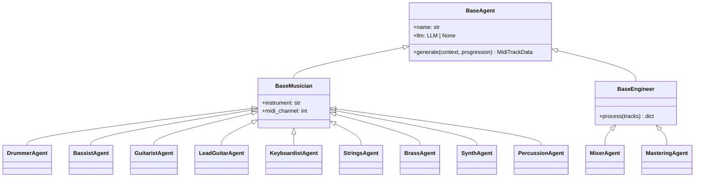

# Agents

Every instrument is driven by a dedicated agent class that extends `BaseMusician` (for performers) or `BaseEngineer` (for processing roles). All agents receive a `SessionContext` and return structured `MidiTrackData` or configuration objects.

---

## Agent Hierarchy



---

## Musician Agents

### DrummerAgent

**Module:** `audio_engineer.agents.musician.drummer`  
**MIDI channel:** 9 (General MIDI drum channel)

Generates kick, snare, and hi-hat patterns based on the genre preset and section type (intro, verse, chorus, outro).

Key behaviors:
- Patterns are drawn from the genre pattern library (`core/patterns.py`) — 22 genres, 40+ patterns
- All 40 PAS Standard Drum Rudiments are available as `DRUM_RUDIMENTS` in `core/patterns.py`
- Velocity varies by beat position to simulate human dynamics

### BassistAgent

**Module:** `audio_engineer.agents.musician.bassist`

Generates root-note bass lines that follow the chord progression and rhythmically lock to the kick drum pattern from the drummer.

Key behaviors:
- Plays the chord root on down beats
- Adds passing tones and octave jumps based on genre feel
- 8 genre-specific `BassPattern` presets available: jazz walking, funk slap, reggae skank, Latin tumbao, Motown, country boom-chick, R&B two-feel, pop root-fifth

### GuitaristAgent

**Module:** `audio_engineer.agents.musician.guitarist`

Generates rhythm guitar parts — strummed chords, power chords, or arpeggios depending on genre.

Key behaviors:
- Chord voicings derived from `music_theory.get_chord_voicing()`
- Genre determines strum pattern and palm-muting style
- Can generate both rhythm and lead layers

### LeadGuitarAgent

**Module:** `audio_engineer.agents.musician.lead_guitar`  
**MIDI channel:** 4

Generates pentatonic licks, scale runs, and fills over chord changes.

Key behaviors:
- Derives lick pitches from the pentatonic minor or blues scale of the current key
- High intensity sections produce denser runs; low intensity plays sparse phrases
- Uses `LEAD_GUITAR` instrument by default; GM program 29 (overdriven guitar)

### KeyboardistAgent

**Module:** `audio_engineer.agents.musician.keyboardist`

Generates chord pads, voicings, and sustained notes. Enabled with `--with-keys` or `with_keys=True`.

Key behaviors:
- Avoids doubling guitar voicings by choosing wider spread chords
- Sustains chords across bar boundaries for pad-like texture
- Reduces velocity relative to guitar to sit in the background

### StringsAgent

**Module:** `audio_engineer.agents.musician.strings`  
**MIDI channel:** 5

Generates sustained legato string lines following chord tones, with style varying by intensity.

Key behaviors:
- **Low intensity** — short pizzicato-style notes (staccato feel)
- **High intensity** — long tremolo/sustain notes across the whole bar
- **Mid intensity** — one note per beat following chord tones
- Supports `STRINGS` (program 48, string ensemble 1) and `VIOLIN` (program 40) instruments

### BrassAgent

**Module:** `audio_engineer.agents.musician.brass`  
**MIDI channel:** 6

Generates stab chords, long tones, and phrase fall-offs for brass instruments.

Key behaviors:
- Stabs are short quarter-note hits on beat 1 and beat 3
- Long tones span the full bar at moderate intensity
- At high intensity, adds additional stab notes mid-phrase
- Program selection by instrument: trumpet (56), trombone (57), tenor sax (66), alto sax (65), brass section (61)

### SynthAgent

**Module:** `audio_engineer.agents.musician.synth`  
**MIDI channel:** 7

Generates sustained pads and 16th-note arpeggio patterns for synthesizer instruments.

Key behaviors:
- **`PAD` instrument** — long whole-note sustains across each bar (programs 88–95)
- **`SYNTHESIZER` instrument** — 16th-note arpeggio cycling through chord tones (programs 80–87)
- Arpeggio direction: ascending by default

### PercussionAgent

**Module:** `audio_engineer.agents.musician.percussion`  
**MIDI channel:** 9

Generates Latin/Afro-Cuban hand drum patterns for ethnic percussion instruments.

Key behaviors:
- Uses dedicated GM percussion note numbers (conga, bongo pitches from `GM_DRUMS`)
- Supports `CONGA`, `BONGO`, `DJEMBE`, and generic `PERCUSSION` instruments
- Patterns are genre-aware (Latin patterns for `Genre.LATIN`, `Genre.BOSSA_NOVA`; funk patterns otherwise)

---

## Engineering Agents

### MixerAgent

**Module:** `audio_engineer.agents.engineer.mixer`

Assigns volume, pan, and EQ metadata to each track. Returns a `MixConfig` dict that is embedded as MIDI control change events.

| Track | Volume | Pan | Notes |
| ----- | ------ | --- | ----- |
| Drums | 100/127 | center | Kick louder than hats |
| Bass | 90/127 | slight left | Low-cut on guitar side |
| Guitar | 85/127 | slight right | — |
| Keys | 75/127 | center | Filtered for space |
| Strings | 72/127 | slight right | — |
| Brass | 80/127 | center | — |
| Synth | 70/127 | center | — |
| Percussion | 85/127 | center | — |

### MasteringAgent

**Module:** `audio_engineer.agents.engineer.mastering`

Applies final loudness targets and embeds metadata (tempo, key, genre) into the MIDI file header.

---

## SessionContext

All agents receive a `SessionContext` object that carries:

| Field | Type | Description |
| ----- | ---- | ----------- |
| `session_id` | `str` | UUID for this generation run |
| `genre` | `str` | Genre preset |
| `key` | `str` | Root note |
| `mode` | `str` | Scale mode |
| `tempo` | `int` | BPM |
| `sections` | `list[SectionConfig]` | Per-section chord progressions and lengths |
| `tracks` | `dict[str, MidiTrackData]` | Completed tracks from earlier agents |

The `tracks` field grows as each agent completes, giving later agents access to previous results.

---

## Orchestration Order

The `SessionOrchestrator` generates tracks in a fixed order so each agent can react to what came before:

1. `DrummerAgent` — establishes the rhythmic foundation
2. `BassistAgent` — locks to the kick drum
3. `GuitaristAgent` — rhythm guitar
4. `LeadGuitarAgent` — melodic fills and licks
5. `KeyboardistAgent` — chord pads
6. `StringsAgent` — orchestral color
7. `BrassAgent` — horn stabs and lines
8. `SynthAgent` — pads and arpeggios
9. `PercussionAgent` — hand drums

---

## LLM Integration

Every musician agent accepts an optional `llm` parameter:

```python
from langchain_openai import ChatOpenAI
from audio_engineer.agents.musician.drummer import DrummerAgent

agent = DrummerAgent(llm=ChatOpenAI(model="gpt-4o"))
```

When an LLM is present, the agent sends a structured prompt describing the genre, key, and section, then parses the response into MIDI note data. Without an LLM, the agent falls back to deterministic algorithmic generation.

For provider-level LLM MIDI generation (rather than per-agent), see [`LLMMidiProvider`](providers.md#llmmidiprovider).

---

## Adding a New Agent

1. Create `src/audio_engineer/agents/musician/my_agent.py`
2. Extend `BaseMusician`
3. Implement `generate(context: SessionContext, progression: list) -> MidiTrackData`
4. Register the agent in `SessionOrchestrator._build_agents()`
5. Export it from `agents/musician/__init__.py`
6. Add tests in `tests/agents/test_my_agent.py`
