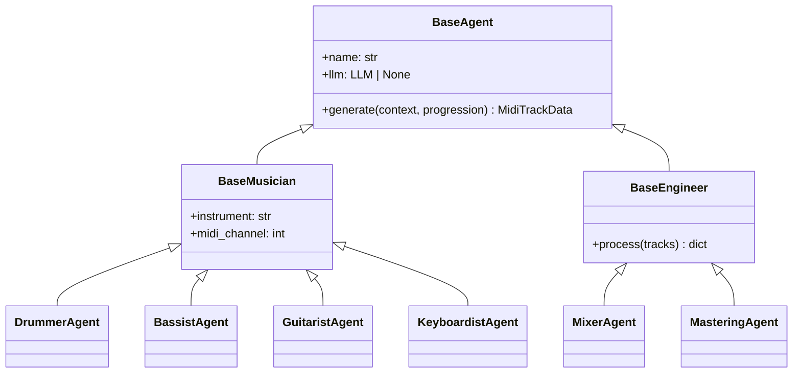

# Agents

Every instrument is driven by a dedicated agent class that extends `BaseMusician` (for performers) or `BaseEngineer` (for processing roles). All agents receive a `SessionContext` and return structured `MidiTrackData` or configuration objects.

---

## Agent Hierarchy



---

## Musician Agents

### DrummerAgent

**Module:** `audio_engineer.agents.musician.drummer`

Generates kick, snare, and hi-hat patterns based on the genre preset and section type (intro, verse, chorus, outro).

Key behaviors:
- Patterns are drawn from the genre pattern library (`core/patterns.py`)
- Velocity varies by beat position to simulate human dynamics
- MIDI channel 10 (0-indexed: channel 9) — General MIDI drum channel

### BassistAgent

**Module:** `audio_engineer.agents.musician.bassist`

Generates root-note bass lines that follow the chord progression and rhythmically lock to the kick drum pattern from the drummer.

Key behaviors:
- Plays the chord root on down beats
- Adds passing tones and octave jumps based on genre feel
- Listens to the drum track output to align with kick hits

### GuitaristAgent

**Module:** `audio_engineer.agents.musician.guitarist`

Generates rhythm guitar parts — strummed chords, power chords, or arpeggios depending on genre.

Key behaviors:
- Chord voicings derived from `music_theory.get_chord_voicing()`
- Genre determines strum pattern and palm-muting style
- Can generate both rhythm and lead layers

### KeyboardistAgent

**Module:** `audio_engineer.agents.musician.keyboardist`

Generates chord pads, voicings, and sustained notes. Enabled with `--with-keys` or `with_keys=True`.

Key behaviors:
- Avoids doubling guitar voicings by choosing wider spread chords
- Sustains chords across bar boundaries for pad-like texture
- Reduces velocity relative to guitar to sit in the background

---

## Engineering Agents

### MixerAgent

**Module:** `audio_engineer.agents.engineer.mixer`

Assigns volume, pan, and EQ metadata to each track. Returns a `MixConfig` dict that is embedded as MIDI control change events.

| Track | Volume | Pan | Notes |
| ----- | ------ | --- | ----- |
| Drums | 100/127 | center | Kick louder than hats |
| Bass | 90/127 | slight left | Low-cut on guitar side |
| Guitar | 85/127 | slight right | — |
| Keys | 75/127 | center | Filtered for space |

### MasteringAgent

**Module:** `audio_engineer.agents.engineer.mastering`

Applies final loudness targets and embeds metadata (tempo, key, genre) into the MIDI file header.

---

## SessionContext

All agents receive a `SessionContext` object that carries:

| Field | Type | Description |
| ----- | ---- | ----------- |
| `session_id` | `str` | UUID for this generation run |
| `genre` | `str` | Genre preset |
| `key` | `str` | Root note |
| `mode` | `str` | Scale mode |
| `tempo` | `int` | BPM |
| `sections` | `list[SectionConfig]` | Per-section chord progressions and lengths |
| `tracks` | `dict[str, MidiTrackData]` | Completed tracks from earlier agents |

The `tracks` field grows as each agent completes, giving later agents access to previous results.

---

## LLM Integration

Every musician agent accepts an optional `llm` parameter:

```python
from langchain_openai import ChatOpenAI
from audio_engineer.agents.musician.drummer import DrummerAgent

agent = DrummerAgent(llm=ChatOpenAI(model="gpt-4o"))
```

When an LLM is present, the agent sends a structured prompt describing the genre, key, and section, then parses the response into MIDI note data. Without an LLM, the agent falls back to deterministic algorithmic generation.

---

## Adding a New Agent

1. Create `src/audio_engineer/agents/musician/my_agent.py`
2. Extend `BaseMusician`
3. Implement `generate(context: SessionContext, progression: list) -> MidiTrackData`
4. Register the agent in `SessionOrchestrator._build_agents()`
5. Add tests in `tests/agents/test_my_agent.py`
