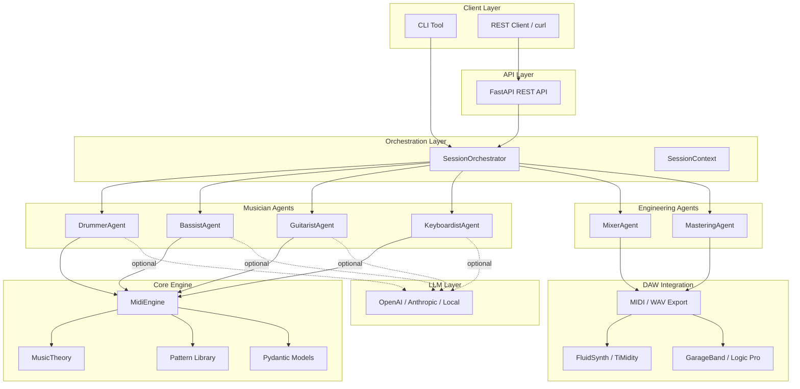
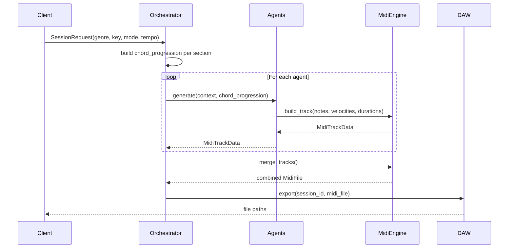

# Architecture

## System Overview

AI Music Studio is a multi-agent system that generates MIDI backing tracks by simulating a session band. LLM-powered musician agents collaborate under a session orchestrator to produce genre-appropriate parts, which are then processed by audio engineering agents for mixing and mastering.

---

## High-Level Architecture



---

## Orchestration Order

Agents run **sequentially** so each can react to what came before:

```
1. DrummerAgent    → establishes the groove
2. BassistAgent    → locks to the kick drum + chord root
3. GuitaristAgent  → fills harmonic space around bass
4. KeyboardistAgent (optional) → adds pads/voicings in remaining space
5. MixerAgent      → assigns levels, pan, EQ to all tracks
6. MasteringAgent  → applies final loudness metadata
```

This order is **intentional and stable**. Do not change it unless the task explicitly requires it.

---

## Data Flow



---

## Module Map

```
src/audio_engineer/
├── agents/
│   ├── base.py              BaseMusician, BaseEngineer, SessionContext
│   ├── orchestrator.py      SessionOrchestrator
│   ├── musician/
│   │   ├── drummer.py       DrummerAgent
│   │   ├── bassist.py       BassistAgent
│   │   ├── guitarist.py     GuitaristAgent
│   │   └── keyboardist.py   KeyboardistAgent
│   └── engineer/
│       ├── mixer.py         MixerAgent
│       └── mastering.py     MasteringAgent
├── core/
│   ├── models.py            Pydantic models
│   ├── music_theory.py      Scales, chords, progressions
│   ├── midi_engine.py       MIDI file construction (mido)
│   ├── patterns.py          Genre-specific pattern library
│   ├── rhythm.py            Rhythmic utilities
│   └── constants.py         TICKS_PER_BEAT, MIDI note maps
├── daw/
│   ├── base.py              AbstractDAWBackend
│   ├── export.py            Raw MIDI / WAV file export
│   ├── fluidsynth.py        FluidSynth rendering
│   ├── timidity.py          TiMidity rendering
│   ├── garageband.py        GarageBand AppleScript integration
│   └── logic_pro.py         Logic Pro AppleScript integration
├── api/
│   ├── app.py               FastAPI application factory
│   └── routes/              Sessions, tracks, exports
└── config/
    ├── settings.py          pydantic-settings configuration
    └── logging.py           Logging setup
```

---

## Key Design Decisions

### Why Sequential Generation?

Each instrument in a real session band listens to what has already been played. The drummer sets the groove; the bassist locks to the kick; the guitarist fills harmonic space around the bass. Sequential generation naturally models this dependency chain.

### Why Pydantic Models?

All external boundaries (API requests/responses, agent outputs, config) use Pydantic v2 models. This gives us:
- Validated inputs at runtime
- Clear, serializable data contracts between agents
- Auto-generated OpenAPI schema for the REST API

### Why mido?

[mido](https://mido.readthedocs.io/) is a lightweight, pure-Python MIDI library. It provides direct control over MIDI message construction without heavyweight abstractions, which keeps the MIDI engine deterministic and testable.

### DAW Integration Tiers

| Tier | Backends | Method |
| ---- | -------- | ------ |
| 1 | FluidSynth, TiMidity | Subprocess call — automated, cross-platform |
| 2 | GarageBand, Logic Pro | AppleScript / OSA — macOS only, semi-automated |
| 3 | MIDI export, WAV export | Manual import — universal fallback |
