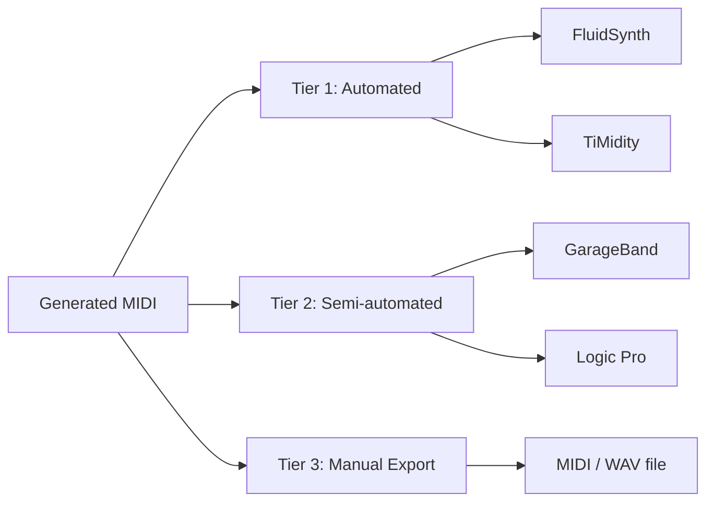

# DAW Integration

AI Music Studio supports three tiers of DAW integration, from fully automated to manual import.

---

## Integration Tiers



| Tier | Backends | Platform | Automation Level |
| ---- | -------- | -------- | ---------------- |
| 1 | FluidSynth, TiMidity | Linux, macOS, Windows | Fully automated via subprocess |
| 2 | GarageBand, Logic Pro | macOS only | Semi-automated via AppleScript |
| 3 | File export | Universal | Manual import |

---

## Tier 1 — FluidSynth

FluidSynth renders MIDI to WAV using a SoundFont (`.sf2`).

### Setup

```bash
# macOS
brew install fluidsynth

# Ubuntu / Debian
sudo apt install fluidsynth fluid-soundfont-gm

# Windows
choco install fluidsynth
```

Download a SoundFont. Good free options:
- [GeneralUser GS](https://schristiancollins.com/generaluser.php) — general MIDI
- [FluidR3_GM](https://packages.ubuntu.com/jammy/fluid-soundfont-gm) — bundled with Ubuntu

Set the path:
```bash
export SOUNDFONT_PATH=/path/to/soundfont.sf2
```

### Usage

```bash
python scripts/generate_demo.py \
  --genre blues \
  --key A \
  --mode minor \
  --render-audio \
  --backend fluidsynth
```

---

## Tier 1 — TiMidity

TiMidity++ is an alternative software synthesizer.

### Setup

```bash
# Ubuntu / Debian
sudo apt install timidity timidity-patches

# macOS
brew install timidity
```

### Usage

```bash
python scripts/generate_demo.py \
  --genre pop \
  --key C \
  --mode major \
  --render-audio \
  --backend timidity
```

---

## Tier 2 — GarageBand (macOS)

The GarageBand backend uses AppleScript to open the generated MIDI file in GarageBand and trigger playback or export.

!!! warning "macOS Only"
    This backend requires macOS and GarageBand to be installed.

### Usage

```python
from audio_engineer.daw.garageband import GarageBandBackend

backend = GarageBandBackend()
backend.open("output/session_full.mid")
```

---

## Tier 2 — Logic Pro (macOS)

Similar to GarageBand but targets Logic Pro via OSA.

!!! warning "macOS Only"
    This backend requires macOS and Logic Pro to be installed.

---

## Tier 3 — File Export (Default)

The default backend (`export`) writes:

| File | Format | Contents |
| ---- | ------ | -------- |
| `<session-id>_drums.mid` | MIDI | Drum track (channel 10) |
| `<session-id>_bass.mid` | MIDI | Bass track |
| `<session-id>_guitar.mid` | MIDI | Guitar track |
| `<session-id>_keys.mid` | MIDI | Keyboard track (if enabled) |
| `<session-id>_full.mid` | MIDI | All tracks combined |

Import the combined file into any DAW (Ableton, Logic, Reaper, etc.).

---

## Backend API

All backends implement `AbstractDAWBackend` from `audio_engineer.daw.base`:

```python
class AbstractDAWBackend:
    def export(self, session_id: str, midi_file: MidiFile, output_dir: Path) -> list[Path]:
        """Write output files and return their paths."""
        ...

    def render_audio(self, midi_path: Path, output_path: Path) -> Path:
        """Render MIDI to audio. Optional — raises NotImplementedError if unsupported."""
        ...
```

To add a new backend, subclass `AbstractDAWBackend`, implement `export()`, and register it in `daw/__init__.py`.
